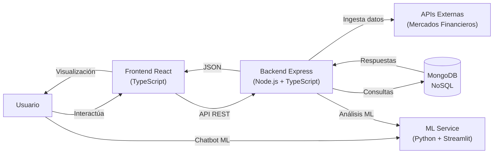
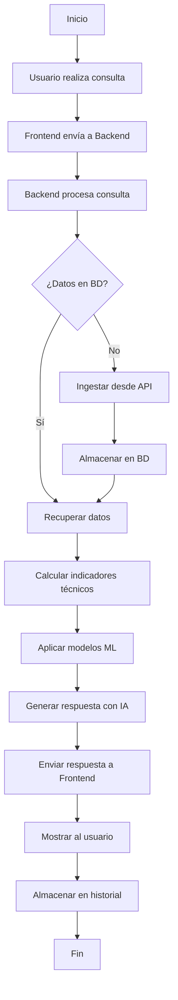
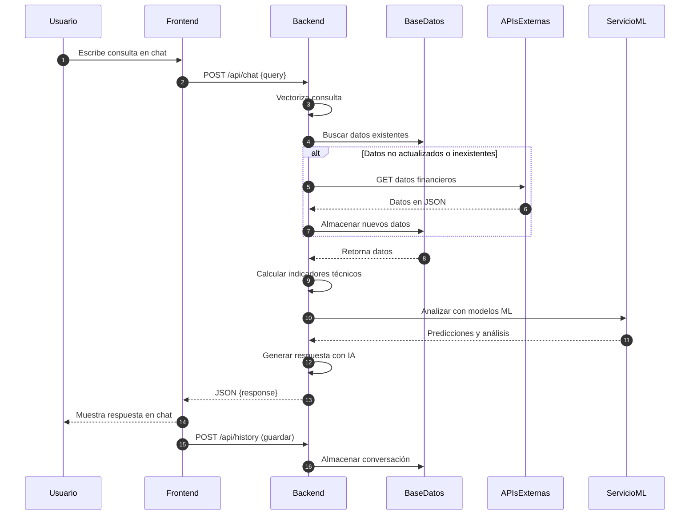

# TP Final Base de Datos - Análisis Financiero IA - v1.0.0

[](https://reactjs.org/)

[](https://www.typescriptlang.org/)

[](https://nodejs.org/)

[](https://expressjs.com/)

[](https://www.mongodb.com/)

[](https://www.python.org/)


- Proveer respuestas interpretables y accionables sobre instrumentos financieros.

## 📋 Descripción- Soportar datos heterogéneos: acciones, criptomonedas, divisas (FX), startups, entre otros

- Facilitar la extensibilidad para incorporar nuevos parámetros, fuentes y modelos.

Plataforma web inteligente para análisis financiero y empresarial desarrollada como trabajo práctico final de Base de Datos. El sistema permite realizar consultas en lenguaje natural sobre instrumentos financieros y genera informes estructurados con series temporales, indicadores técnicos y fundamentales, análisis estadístico y recomendaciones basadas en Inteligencia Artificial. Integra ingestión de datos desde APIs externas y web scraping, almacenamiento flexible en base de datos NoSQL, procesamiento estadístico con ML y personalización mediante contexto conversacional.

## Alcance

## 🚀 Características Principales

- **Entradas:** Consultas en lenguaje natural (ejemplo: “¿Cuál es la mejor empresa para invertir ahora?”).

- **Chatbot Inteligente**- **Salidas:** Informes estructurados con datos en tiempo real e históricos, indicadores técnicos, métricas de riesgo y recomendaciones justificadas.

  - Consultas en lenguaje natural- **Integraciones:** APIs de mercado, web scraping como respaldo, motores de embeddings y (opcional) integración con Python + ML.

  - Respuestas contextualizadas

  - Historial conversacional persistente## Flujo de Funcionamiento

  - Interfaz intuitiva y responsiva

1. Recepción de la consulta (chat o API).

- **Análisis Financiero Automatizado**2. Preprocesamiento y vectorización para detectar intención y entidades.

  - Indicadores técnicos (RSI, MACD, medias móviles, ATR)3. Búsqueda en la base de datos local (si existe historial o datos previos).

  - Métricas de riesgo (VaR, volatilidad, correlaciones)4. Ingesta de datos externos en caso de ser necesario (API/web scraping).

  - Series temporales y análisis estadístico5. Cálculo de estadísticas, indicadores técnicos y modelos de ML/series temporales.

  - Generación de informes estructurados6. Generación del informe mediante plantilla y explicación (posible uso de LLM).

  - Personalización de la respuesta según el contexto conversacional.

- **Ingesta de Datos Flexible**8. Entrega al usuario y almacenamiento del intercambio para aprendizaje futuro.

  - Integración con APIs de mercado financiero

  - Web scraping como respaldo## Ejemplo de Ejecución

  - Soporte para múltiples tipos de activos (acciones, criptomonedas, divisas FX, startups)

  - Actualización en tiempo real**Consulta:** ¿Cuál es la mejor empresa para invertir ahora?

- **Machine Learning**- Vectorización de la pregunta para identificar horizonte temporal y tipo de activo.

  - Modelos predictivos con Prophet, PyTorch y TensorFlow- Consulta a la base de datos: precios, volumen, indicadores técnicos, noticias relevantes.

  - Procesamiento de lenguaje natural- Ingesta de datos externos si la información es insuficiente.

  - Vectorización semántica con embeddings- Ejecución de cálculos: RSI, MACD, medias móviles, volatilidad, VaR, correlaciones.

  - Recomendaciones personalizadas- Generación de informe con resumen numérico, gráfico, conclusión y nivel de confianza.

- **Dashboards y Reportes**## Diseño de Almacenamiento

  - Visualizaciones interactivas con Plotly

  - Exportación a múltiples formatos (Excel, CSV, PDF)**Recomendación:** Base de datos NoSQL + motor de vectores para flexibilidad y velocidad.

  - Gráficos de series temporales

  - Métricas clave en tiempo real**Esquema sugerido:**

- id

## 📱 Guía de Uso- tipo (acción, cripto, FX, startup, etc.)

- fuente (enlaces)

### Acceso al Sistema- series (timestamp, open, high, low, close, volume)

- indicadores (RSI, MACD, MA, ATR, etc.)

1. Inicia el backend: `cd backend && npm run dev`- pivot_points

2. Inicia el frontend: `cd frontend && npm start`- technical_analysis.summary

3. Accede a la aplicación en `http://localhost:3000`- metadata (sector, país, ticker, ISIN)

4. Para el módulo ML/Chatbot con Streamlit: `cd ml && streamlit run main.py`- embeddings (vector semántico)

- ingesta.timestamp

### Interfaz Principal- quality_flags (datos faltantes, confiabilidad de fuente)

- **Chat**: Interfaz principal para realizar consultas en lenguaje natural## Vectorización y Personalización

- **Sidebar**: Navegación entre módulos (Chat IA, Dashboards, Reportes, ML Modelos)

- **Dashboards**: Visualización de métricas financieras (próximamente)- Motor de embeddings (FAISS, Milvus, Pinecone) para:

- **Reportes**: Generación y descarga de informes estructurados (próximamente)    - Consultas y contexto conversacional.

- Documentos de análisis.

### Funciones Principales    - Historial semántico por conversación

- Las respuestas se re-ranquean según la similitud de embeddings entre la consulta y el estado actual del chat.

#### Consultas en Lenguaje Natural

## Generación de Reportes y Gráficos

1. Escribe tu consulta en el campo de texto (ejemplo: "¿Cuál es la mejor empresa para invertir ahora?")

2. El sistema procesará tu consulta mediante IA- Gráficos interactivos y estáticos (series de precios, indicadores, correlaciones).

3. Recibirás una respuesta contextualizada con análisis y recomendaciones- Reportes descargables en PDF y XLSX con tablas, gráficos y notas explicativas.

4. El historial se mantiene durante la sesión para seguimiento- Tecnologías recomendadas: matplotlib, plotly, pandas, openpyxl, xlsxwriter, ReportLab, wkhtmltopdf, WeasyPrint.

- Flujo: generación en backend, incrustación en informe, exportación y almacenamiento para trazabilidad.

### Análisis Financiero

## Consideraciones de ML/IA

El sistema analiza automáticamente:

- **Precios históricos**: Open, High, Low, Close, Volume- Modelos de series temporales: ARIMA, Prophet, LSTM, Transformers según horizonte y calidad de datos.

- **Indicadores técnicos**: RSI, MACD, Medias Móviles, ATR- Modelos explicables: siempre incluir justificación y grado de confianza.

- **Métricas de riesgo**: Volatilidad, VaR, correlaciones- Integración con Python + MATE 3: confirmar compatibilidad y recursos disponibles.

- **Análisis fundamental**: Sector, país, métricas empresariales

- **Recomendaciones**: Basadas en el análisis completo y contexto del usuario## Trazabilidad y Auditoría

## 🛠️ Tecnologías- Mantener ingestion_logs y decision_logs para registrar datos utilizados en cada recomendación

- Guardar versión de modelo y parámetros en cada informe.

### Frontend

## Requerimientos No Funcionales

- **React** 18 con TypeScript

- **Create React App** (configuración inicial)- Latencia objetivo para consultas simples: < 2 segundos (con datos en caché/BD local).

- **Bootstrap** 5 para estilos base- Jobs ETL periódicos para sincronización de fuentes externas.

- **CSS Modules** para estilos personalizados- Monitorización de calidad de datos y alertas (datos faltantes, drift).

- **Fetch API** para comunicación con backend

## Tecnologías Sugeridas

### Backend

- Base de datos NoSQL: MongoDB.

- **Node.js** con Express- Vector DB: FAISS, Milvus, Pinecone.

- **TypeScript** para tipado estático- Backend: Node.js (TypeScript).

- **CORS** para manejo de peticiones cross-origin- ML: Python (scikit-learn, statsmodels, PyTorch, TensorFlow).

- **Dotenv** para variables de entorno- Frontend: Microservicio REST/GraphQL, dashboard con gráficos (Plotly, Recharts).

- **GraphQL** (planificado)- Deploy: Vercel, Firebase, Hostinger.

- **MongoDB/Mongoose** para base de datos NoSQL

## Opcionales

### Machine Learning / Python

- Entrenamiento de modelos propios de series temporales (Transformers/LSTM).

- **Streamlit** para interfaz de chatbot- Fine-tuning o entrenamiento de LLM para generación de informes y respuestas.

- **OpenAI API** / **OpenRouter** para procesamiento de lenguaje natural- Infraestructura: cluster de entrenamiento (GPU/TPU), versionado de modelos (MLflow/DVC), pipeline de MLOps.

- **Pandas** y **NumPy** para análisis de datos- Evaluar pros/contras: mayor control y privacidad vs coste y complejidad operativa.

- **Scikit-learn** para modelos ML

- **Statsmodels** para análisis estadístico[tablero](https://www.notion.so/263aabf0ff7280dc8217c381c8a95c7b?pvs=21)

- **Prophet**, **PyTorch**, **TensorFlow** para modelos predictivos
- **Matplotlib** y **Plotly** para visualizaciones
- **ReportLab** para generación de PDFs

### Herramientas de Desarrollo

- **ts-node** para ejecución de TypeScript
- **nodemon** para desarrollo con hot-reload
- **ESLint** y **Prettier** (recomendado)

## 📦 Dependencias Principales

### Backend (`backend/package.json`)

```json
{
  "dependencies": {
    "cors": "^2.8.5",
    "express": "^4.18.2",
    "dotenv": "^16.0.0",
    "graphql": "^16.8.1",
    "mongodb": "^5.7.0",
    "mongoose": "^7.6.0"
  },
  "devDependencies": {
    "@types/cors": "^2.8.19",
    "nodemon": "^3.0.3",
    "ts-node": "^10.9.1",
    "typescript": "^5.3.3"
  }
}
```

### Frontend (`frontend/package.json`)

- **React** y **React-DOM**
- **TypeScript**
- **Bootstrap**
- **Web Vitals** para métricas de rendimiento

### ML/Python (`ml/requirements.txt`)

- pandas, numpy, scikit-learn, statsmodels
- matplotlib, plotly
- openpyxl, xlsxwriter, reportlab
- prophet, torch, tensorflow
- openai, streamlit

## 🏗️ Arquitectura del Sistema



### Componentes Principales

1. **Frontend (React + TypeScript)**
   - Componente Chat: Interfaz conversacional principal
   - Componente Sidebar: Navegación entre módulos
   - Servicio geminiApi: Comunicación con backend

2. **Backend (Express + TypeScript)**
   - API REST en `/api/chat` para procesamiento de consultas
   - Integración con OpenRouter/DeepSeek para IA
   - Gestión de base de datos MongoDB (planificado)
   - Endpoints para ingesta y análisis de datos

3. **ML Service (Python + Streamlit)**
   - Chatbot independiente con Streamlit
   - Procesamiento de lenguaje natural
   - Modelos de ML para predicciones
   - Generación de reportes automatizados

4. **Base de Datos (MongoDB - NoSQL)**
   - Esquema flexible para datos heterogéneos
   - Colecciones: instruments, reports, users, conversations
   - Índices para búsquedas rápidas
   - Embeddings vectoriales para búsqueda semántica

### Flujo de Datos

1. El usuario realiza una consulta en lenguaje natural
2. El frontend envía la consulta al backend vía API REST
3. El backend procesa la consulta:
   - Vectoriza el texto para detectar intención
   - Busca información relevante en la base de datos
   - Si es necesario, consulta APIs externas para datos actualizados
   - Calcula indicadores técnicos y métricas de riesgo
4. El backend genera una respuesta estructurada usando IA
5. La respuesta se envía al frontend y se muestra al usuario
6. El intercambio se almacena en la BD para aprendizaje futuro

## 🔒 Seguridad

### Autenticación y Autorización (Planificado)

- Sistema de usuarios con roles
- JWT para autenticación segura
- Sesiones con tiempo limitado
- Registro de auditoría de consultas

### Protección de Datos

- Variables de entorno para claves API (`.env`)
- **IMPORTANTE**: Las claves API NO deben commitearse
- Validación y sanitización de entradas
- Encriptación de datos sensibles

### Configuración de Variables de Entorno

**PowerShell (Windows):**

```powershell
$env:OPENROUTER_API_KEY = "tu-clave-api-aqui"
```

**Archivo `.env`:**

```powershell
OPENROUTER_API_KEY=tu-clave-api-aqui
PORT=3001
```

## 📊 Diagramas

### Diagrama de Flujo



### Esquema de Base de Datos (NoSQL - MongoDB)

- **Colección: instruments**

```json
{
  "_id": "ObjectId",
  "tipo": "acción | cripto | FX | startup",
  "ticker": "AAPL",
  "nombre": "Apple Inc.",
  "fuente": ["https://api.example.com"],
  "series": [
    {
      "timestamp": "2024-01-01T00:00:00Z",
      "open": 150.0,
      "high": 155.0,
      "low": 149.0,
      "close": 154.0,
      "volume": 1000000
    }
  ],
  "indicadores": {
    "RSI": 65.5,
    "MACD": {"macd": 2.5, "signal": 2.0, "histogram": 0.5},
    "MA_50": 152.0,
    "MA_200": 148.0,
    "ATR": 3.2
  },
  "pivot_points": {
    "pivot": 152.0,
    "r1": 154.0,
    "r2": 156.0,
    "s1": 150.0,
    "s2": 148.0
  },
  "technical_analysis": {
    "summary": "compra | venta | neutral",
    "confidence": 0.85
  },
  "metadata": {
    "sector": "Technology",
    "pais": "USA",
    "ISIN": "US0378331005"
  },
  "embeddings": [0.1, 0.2, ...],
  "ingesta": {
    "timestamp": "2024-01-01T12:00:00Z",
    "fuente": "API_XYZ"
  },
  "quality_flags": {
    "datos_faltantes": false,
    "confiabilidad": "alta"
  }
}
```

- **Colección: conversations**

```json
{
  "_id": "ObjectId",
  "session_id": "uuid",
  "user_id": "ObjectId",
  "messages": [
    {
      "role": "user | assistant",
      "content": "texto del mensaje",
      "timestamp": "2024-01-01T12:00:00Z"
    }
  ],
  "context": {
    "instruments_mentioned": ["AAPL", "GOOGL"],
    "analysis_performed": ["RSI", "MACD"]
  },
  "created_at": "2024-01-01T12:00:00Z"
}
```

- **Colección: reports**

```json
{
  "_id": "ObjectId",
  "user_id": "ObjectId",
  "query": "¿Cuál es la mejor empresa para invertir?",
  "instruments_analyzed": ["AAPL", "GOOGL", "MSFT"],
  "recommendation": {
    "symbol": "AAPL",
    "action": "compra",
    "confidence": 0.85,
    "reasoning": "Análisis detallado..."
  },
  "technical_indicators": {},
  "risk_metrics": {},
  "created_at": "2024-01-01T12:00:00Z"
}
```

### Diagrama de Secuencia



## 🚀 Instalación y Ejecución

### Prerrequisitos

- Node.js 16+ y npm
- Python 3.8+
- MongoDB (local o remoto)
- Clave API de OpenRouter/OpenAI

### Instalación

```powershell
# Clonar repositorio
git clone https://github.com/LisanRios/TP-final-base-de-datos.git
cd TP-final-base-de-datos

# Instalar dependencias del backend
cd backend
npm install

# Instalar dependencias del frontend
cd ../frontend
npm install

# Instalar dependencias de Python
cd ../ml
pip install -r requirements.txt
```

### Configuración

- Crear archivo `.env` en la raíz y en `backend/`:

```env
OPENROUTER_API_KEY=tu-clave-api
PORT=3001
MONGODB_URI=mongodb://localhost:27017/tp-final-bd
```

- Configurar MongoDB:

1. Instalar MongoDB Community Edition
2. O usar MongoDB Atlas (cloud)
3. Actualizar URI de conexión en `.env`

### Ejecución en Desarrollo

```powershell
# Terminal 1: Backend
cd backend
npm run dev

# Terminal 2: Frontend
cd frontend
npm start

# Terminal 3: ML Service (opcional)
cd ml
streamlit run main.py
```

El frontend estará disponible en `http://localhost:3000` y el backend en `http://localhost:3001`.

## 📚 Herramientas Externas

- [Mermaid](https://mermaid.live/edit) para visualización de diagramas
- [Shields.io](https://shields.io/) para badges de tecnologías
- [OpenRouter](https://openrouter.ai/) para acceso a modelos de IA
- [MongoDB Atlas](https://www.mongodb.com/cloud/atlas) para base de datos en la nube
- [Notion](https://www.notion.so/) para gestión de proyecto

## 📝 Historial de Versiones

- **v1.0.0**: Versión inicial con chatbot funcional y estructura base del proyecto
  - Frontend React con TypeScript
  - Backend Express con integración a OpenRouter
  - Módulo ML con Streamlit
  - Estructura de base de datos NoSQL planificada
  - Interfaz de chat con historial de mensajes
  - Sidebar de navegación

## 🔗 Enlaces Útiles

- [Tablero de Notion](https://www.notion.so/263aabf0ff7280dc8217c381c8a95c7b?pvs=21) - Gestión del proyecto
- [Repositorio GitHub](https://github.com/LisanRios/TP-final-base-de-datos)

## 🤝 Contribuciones

Proyecto desarrollado como trabajo práctico final para la materia Base de Datos.

---

© 2025 TP Final Base de Datos - Análisis Financiero con IA
